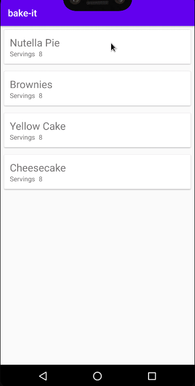

# bake-it

Android app that explores baking recipes from an Udacity server. Includes its own widget for accessing quickly a recipe and can display a video turorial if the recipe has one.

## Motivation
Bake-it is an Android app programmed in Java, created for personal self-develpment and exploration of design and programming practices for the Android OS including:

- [x] Building a Widget for the home screen.
- [x] Utilizing ExoPlayer to display videos from an API.
- [x] Applying Master/Detail flow.
- [x] Using ExecutorServices to handle network requests.
- [x] Decoding JSON files comming from an API and mapping them to local objects.
- [x] Checking if the user has active network connection to use the app.
- [x] Testing with Espresso: Idling Resources.
- [x] Using RecyclerView and adapters to display lists of recipes and steps comming from the API.
